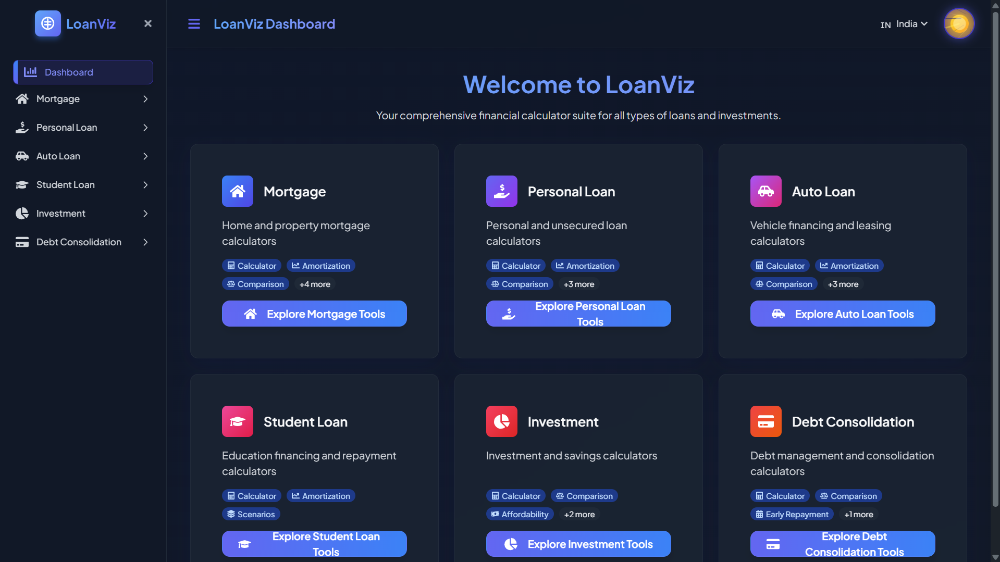
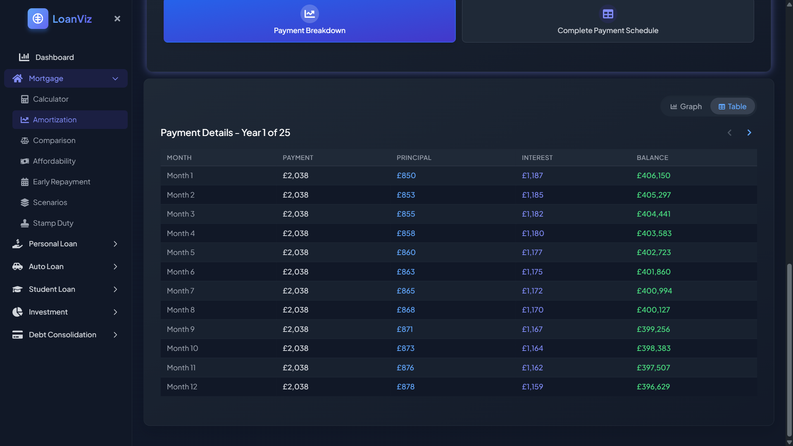
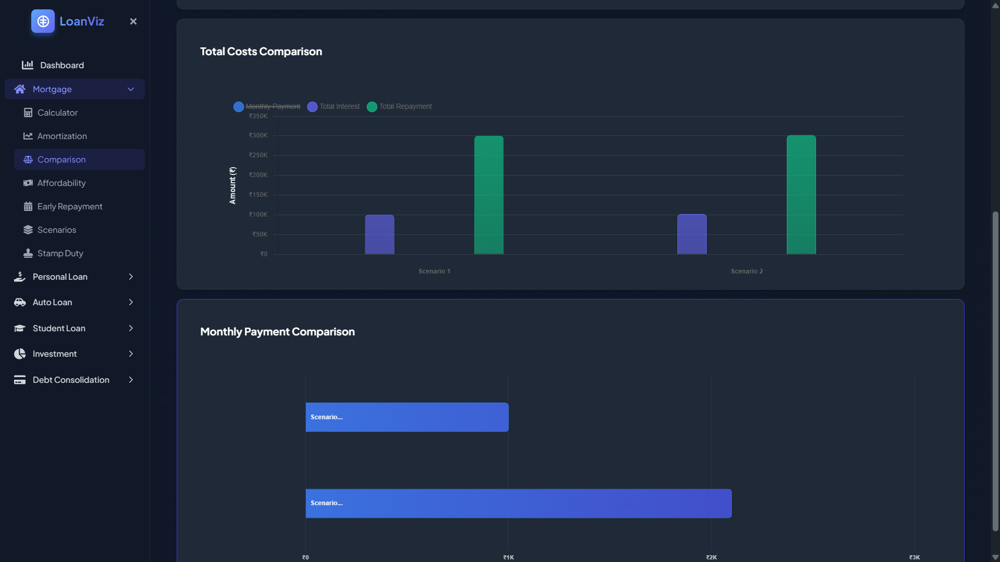
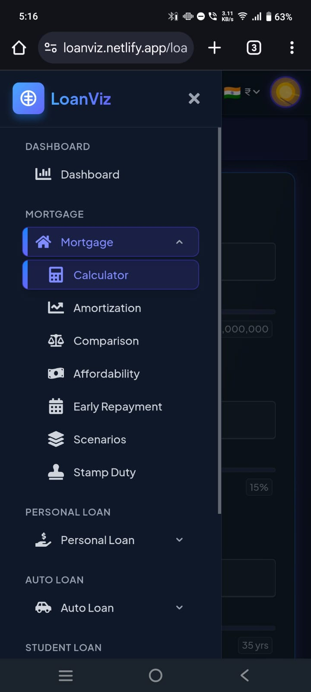

# LoanViz

A financial calculator that helps visualize loan payments, mortgages, and other financial scenarios.



## What's this?

I built LoanViz to solve my own frustrations with existing mortgage calculators. Most tools out there don't give you a clear picture of how your payments break down over time or let you compare different scenarios easily.

This tool helps with:
- Basic loan calculations
- Mortgage payment breakdowns
- Amortization schedules with visual charts
- Comparing different loan scenarios
- Stamp duty calculations (UK/India)
- Debt consolidation planning
- Early repayment calculations

## Tech Stack

- React 19
- Vite
- TailwindCSS
- DaisyUI
- Chart libraries (ApexCharts, Recharts)
- Framer Motion for animations

## Features

- Responsive design that works on mobile and desktop
- Dark/light mode
- Region detection for UK/India
- Interactive charts and visualizations
- PDF export for amortization schedules
- Multiple currency support

## Screenshots

### Amortization Schedule with Chart


### Loan Comparison Tool


### Mobile View


## Live Demo

Check out the live version: [https://loanviz.netlify.app](https://loanviz.netlify.app)

## Running Locally

```bash
# Clone the repo
git clone https://github.com/Barun-2005/LoanViz.git

# Install dependencies
npm install

# Start dev server
npm run dev
```

## Future Plans

I'm planning to add:
- More international regions
- Investment calculators
- Retirement planning tools
- Budget integration

Feel free to suggest features or report bugs!
